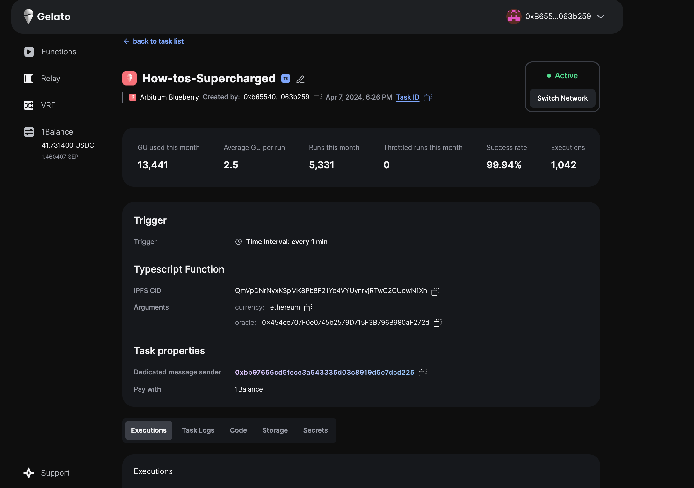
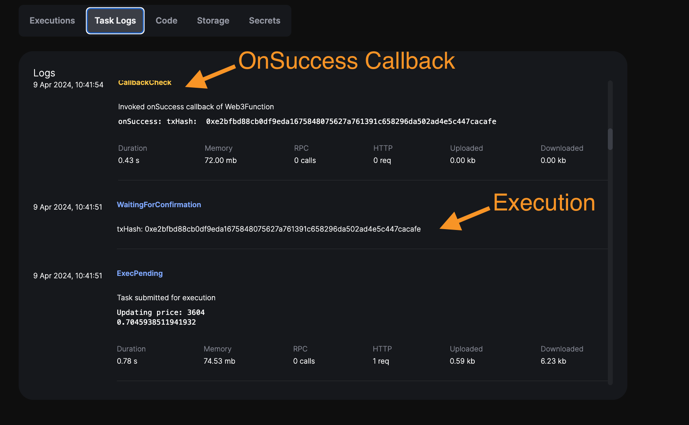
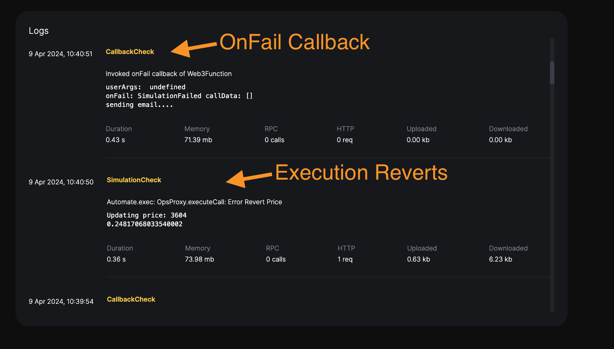

# How To #3 on Gelato: Supercharge your W3f

[](https://youtu.be/Qy-6eERrbKA)

In this `How To`, we will learn how to supercharge a W3F with cool features like storage, multichain providers, etc. We will create a demo Web3 function on [blueberry](https://raas.gelato.network/rollups/details/public/arb-blueberry), one of our [Public Rollup Testnets](https://raas.gelato.network/public-testnets)


## What are we building?

We have deployed and verified the contract [SuperchargedOracle](https://arb-blueberry.gelatoscout.com/address/0x454ee707F0e0745b2579D715F3B796B980aF272d#code).
If you want to learn how to get started with our public testnets, learn where to get tokens, bridge them, deploy a contract, and verify it. Please visit our first video of this series, "How-to #1: Getting Started·

In this contract, we have created the `updatePriceRevert()` method, which reverts when it is called.

We will create a W3F that will query a "coingecko" price and, depending on a random number, will call either the `updatePrice()` or `updatePriceRevert()` so we will be able to test the W3F callbacks.

To create a W3F please follow the `How-to #2 Web3 functions speed run`

## Storage

The W3F provides a simple key/value store that we can access from the web3 function context.

- Setting a key/value
```ts
const lastPrice = +((await storage.get("lastPrice")) ?? "0");
```

- Retrieving a key/value
```ts
 await storage.set("lastPrice", price.toString());
```
 When testing with the w3f command, as explained in `How-to #2 Web3 functions speed run`, we can initialise the storage values by passing the storage object `storage.json` in the W3F root folder.

## MultiChain Provider

 The multichainProvider allows us to instantiate RPC providers for every network Gelato is deployed on.

```ts
 // multichainProvider.default() will instantiate
  // the provider of the chain the W3F is deployed
  const provider = multiChainProvider.default();

  // passing the chainId as follows, we can instantiate
  // a rpc provider for that network, Polygon Blueberry Chain, here
  const polygonProvider = multiChainProvider.chainId((94204209) 
```

## Secrets 
The W3F context also allows you to create and retrieve secrets within your W3F.

- Create the secrets on your task UI


- Read the secrets within your W3F

```ts
  const apikey = (await secrets.get("SENGRID_API")) as string;
  const from = (await secrets.get("FROM_EMAIL")) as string;
  const to = (await secrets.get("TO_EMAIL")) as string; 
```

## W3F CallBacks: OnSuccess and OnFail

When the W3F publishes the transaction on-chain, we have the ability to get notified when it is successful or when it reverts.

We will get notified adding the callbacks to the [index.ts](./web3-functions/simple/index.ts) like this:

#### On Success
```ts
//Web3 Function onSuccess callback
Web3Function.onSuccess(async (context: Web3FunctionSuccessContext) => {
  const { transactionHash } = context;
  console.log("onSuccess: txHash: ", transactionHash);
});
```

#### On Fail
```ts
//Web3 Function onFail callback
Web3Function.onFail(async (context: Web3FunctionFailContext) => {
  const { userArgs, reason, secrets } = context;
  let alertMessage = `Web3 Function Failed. Reason: ${reason}`;
  console.log("userArgs: ", userArgs.canExec);

  if (reason === "ExecutionReverted") {
    alertMessage += ` TxHash: ${context.transactionHash}`;
    console.log(`onFail: ${reason} txHash: ${context.transactionHash}`);
  } else if (reason === "SimulationFailed") {
    alertMessage += ` callData: ${JSON.stringify(context.callData)}`;
    console.log(
      `onFail: ${reason} callData: ${JSON.stringify(context.callData)}`
    );
  } else {
    console.log(`onFail: ${reason}`);
  }
})
 
```

#### W3F Hardhat testing
When doing hardhat local tests, if we want to run the callback methods, we will have to call it like this:
```ts
await simpleW3f.run("onSuccess", { userArgs }); 
```


## Create the Task 

1) Deploy The code to IPFS and retrieve the CID

```ts
npx w3f deploy web3-functions/simple/index.ts
```
And we will get the following output.

```ts
 ✓ Web3Function deployed to ipfs.
 ✓ CID: QmVpDNrNyxKSpMK8Pb8F21Ye4VYUynrvjRTwC2CUewN1Xh
```

Now we head to [gelato app](https://app.gelato.network/functions/create) and create the W3F as shown in  `How-to #2 Web3 functions speed run`.

We can find the W3F task [here](https://app.gelato.network/functions/task/0x50e7c45007cbf53e3a59fef14d2450cc280f466c375aa3bf4dbde85cf116f6b8:88153591557)



Some execution logs

**onSuccess**



**onFail**



## Test

1) Hardhat W3F plugin
```ts
yarn test
```

The output is:
```ts
$ npx hardhat test
  SimpleCounter Tests
> Updating price: 3609
> 0.2505245452624467
{
  state: 'updated',
  storage: { lastPrice: '3609', lastRand: '0.2505245452624467' },
  diff: { lastPrice: '3609', lastRand: '0.2505245452624467' },
  size: 0.05078125
}
> Reverted nicely rand=0.2505245452624467 
    ✔ canExec: true - First execution (690ms)
  1 passing (2s)
✨  Done in 3.62s.
```

2) Using the W3F command

```ts
npx w3f test web3-functions/simple/index.ts --logs --chain-id=88153591557
```

The output is:
```ts
Web3Function building...

Web3Function Build result:
 ✓ Schema: web3-functions/simple/schema.json
 ✓ Built file: /Users/javiermac/Documents/GELATO/200-TUTORIALS/how-tos-on-gelato-4-w3f-supercharged/.tmp/index.js
 ✓ File size: 0.81mb
 ✓ Build time: 57.72ms

Web3Function user args validation:
 ✓ currency: ethereum
 ✓ oracle: 0x454ee707F0e0745b2579D715F3B796B980aF272d

Web3Function running logs:
> Updating price: 3609
> 0.7004731924934517

Web3Function onRun result:
 ✓ Return value: {"canExec":true,"callData":[{"to":"0x454ee707F0e0745b2579D715F3B796B980aF272d","data":"0x8d6cc56d0000000000000000000000000000000000000000000000000000000000000e19"}]}

Simulated Web3Function Storage update:
 ✓ lastPrice: '3609'
 ✓ lastRand: '0.7004731924934517'

Web3Function Runtime stats:
 ✓ Duration: 0.30s
 ✓ Memory: 71.36mb
 ✓ Storage: 0.05kb
 ✓ Network: 1 req [ DL: 6.23kb / UL:  0.63kb]
 ✓ Rpc calls: 0
 ```